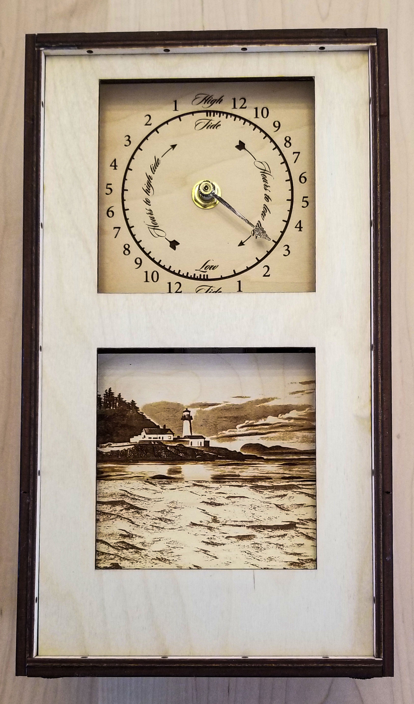

# Tides and Time

This is the Arduino framework-based firmware for a device with a tide clock and a water level 
display. It uses a WiFi connection to the internet to ask the noaa.gov tides and currents 
HTTPS GET REST api for information about the times of for high and low tides and the 
predicted water levels for a specified tide station and displays that information on two
electromechanical displays.

The first display is the tide clock. It is managed by the TideClock library. This library 
drives a hacked quartz clock movement to display how much time there is before the next 
high or low tide. See below for more details.

The second display shows the current water level. It is managed by the WlDisplay library. 
The library uses a small stepper motor to raise and lower the level of the "sea" in an 
illustration of a seaside scene. See below for more details.

Here the seaside illustration was produced for me by StableDiffusion v2.1 using a text 
description of what I wanted and a photo of a similar scene for guidance.

The firmware can communicate to a terminal emulator using the Arduino Serial interface over 
USB. It has a command interpreter that can be used to change various runtime parameters such 
as the WiFi SSID and password to use and which tidal station to show the data for, among 
others. There are also various utility commands that may be of interest. The "h" command 
displays a list.
 
Once the configuration is set, it can be stored in non-volatile memory using the "save" 
command. Once saved, the parameters are used whenever the power comes on or the device is 
reset.

The hardware also has a built-in LiPo battery that lets the clock continue to run when USB 
power goes away. To allow the clock to run for as long as it can, the water level display 
is paused when running on battery. When USB power is restored, it will once again display the 
correct water level. The tide clock continues to run when operating on battery.

This firmware was designed and tested to run on an Adafruit featheresp32-s2 using the Arduino 
framework; no effort was made to make it portable.

The complete NOAA tides and currents api definition may be found at https://api.tidesandcurrents.noaa.gov/api/prod/

The api responses are documented at https://api.tidesandcurrents.noaa.gov/api/prod/responseHelp.html

## TideClock

The TideClock class makes use of a hacked Lavet motor quartz clock movements -- one of the ubiquitous, 
cheapquartz mechanisms powered by a single AA cell. It assumes the movement has been modified to bypass 
the quartz timing mechanism by tying the connections to the ends of its coil to two pins, tickPin 
and tockPin, of the featheresp32-s2. A clock hacked in this way can be advanced by alternating pulses 
on the two pins. Each pulse advances the clock mechanism by one second.

For this application, there are two alternative clock face designs. The first, called the linear 
design, has traditional tide clock markings and one hand: straight up is high tide and straight down 
is low tide. The interval from high and low tide is divided six sub-intervals, showing how many hours 
there are from the current time to low tide. E.g., when the hand gets to the "one o'clock" position 
there are five hours to the upcoming low tide. The interval from low tide to high is similarly 
subdivided to show the number of hours to the next low tide. 

Because tides usually don't occur regularly every six hours, the clock can't simply count off standard 
hours. Over the years, various methods have been employed to make tide clocks show more or less the 
correct number of hours to the next tide. Most commonly, they're set to run so that the hand makes a 
complete trip around the dial every 12 hours and 25 minutes, which is close to the average time it takes 
for the moon to cross the same line of longitude on successive days. That's approximately okay if you 
live where the tides more or less follow that pattern (e.g., the eastern seaboard of the US), but it's 
really pretty unsatisfactory for many places. Where I live in Port Townsend, WA, the tides are much more 
irregular than that because the many tidal rivers, bays, inlets, sounds, and straits all slosh around 
and couple to one another under the influence of the moon's (and, to some extent, the sun's) gravity. 
This tide clock accommodates irregular tides and shows the correct tide time. Here's how it works.

Normally, the time on the face progresses at the same rate a normal clock does, thus showing the correct 
number of hours to the next tide, but when its position indicates it's at the next tide -- high tide, 
say -- TideClock makes a call to a "get next tide" handler function. The handler returns the POSIX time 
of the next tide (low in this case). If the time until the next tide is more than six hours off, the clock  
pauses for the appropriate amount of time before starting up again. If, on the other hand, the time to the 
next (low) tide is less than six hours away, the clock ticks as fast as it can until it points to the 
right place and then resumes moving at normal clock-speed once more. Things work exactly the same way when 
the clock gets to low tide: It asks the handler for the time of the next high tide and then pauses or 
races forward as needed before beginning once again to run normally.

The second face design, called the nonlinear design, also shows the correct time to the next tide, but 
does so in a different way. Instead of showing six hours between tides, it shows 18. But the spacing is 
very nonlinear. When it's a long time to the next tide, the speed at which the hand travels is very low. 
As the time to the next tide gets closer, the speed with which the hand travels gradually increases. When 
when the high or low tide is reached, it uses the "get next tide" handler to figure out how much time 
there is until the next tide and pauses (hardly ever) or zips forward until the hand points to the 
correct place. From there, it resumes moving, but nonlinearly, of course.

With both face designs, the single hand is attached to the quartz clock mechanism's minute hand, even 
though it indicates hours. No hands are attached to the mechanism's other hand positions.

How the "get next tide" handler function works isn't a concern of the clock, but typically it works by
asking an online tide model service for the requisite information at the location of interest. For the US, 
NOAA comes to mind.

To use the TideClock, instantiate a TideCLock object as a global variable, telling it which GPIO
pins the Lavet motor is connected to. In the Arduino setup function, use the begin member function to 
tell it what the address of the handler function is and whether the clock face is linear or nonlinear. 
Then in in the Arduino loop function invoke run member function, passing the current POSIX time. Do 
this at least once every six seconds, or more often if you don't have anything better for the Arduino to 
do.

TideClock assumes that the clock's position has been set manually at the time of the first call to 
run().

## WlDisplay

A WlDisplay object is the software interface to a water level display that shows the current 
water level for a tide clock display device. It's powered by a 28BYJ-48 stepper via a 
ULN2003-based driver board using the GyverStepper library (which is way overkill for this use). 
The stepper runs a chain drive that raises and lowers a drawing of the sea surface to gradually 
cover and uncover a drawing of the beach and land as seen from off shore, thus displaying the 
current water level.

The stepper runs on 5V from the USB input power, the featheresp32-s2 we run on has a backup 
battery so it can keep going if unplugged for a while. But if there's no USB power, there's 
no 5V because the hardware doesn't include a boost converter, so we can't move the display. To 
detect the state of the USB power, the device implementation provides a "power present" signal 
on the GPIO pin powerPin.

When USB power comes up, the display has no idea where it is in its range except that the water 
level it's displaying is at or above the minimum physically displayable level. To figure out 
where it is, the device contains a magnet that moves as the displayed water level changes and 
a 3144 Hall-effect sensor that triggers the sensor at the physical position corresponding to 
the minimum displayable water level. To home the device, we drive the stepper down (which, it 
turns out, is clockwise) until the Hall-effect sensor trips.

The typical way to use WlDisplay is to create a WlDisplay object as a global variable. Then 
invoke the begin member function in the Arduino setup() to do the initializaton. While running, 
use the setLevel member function whenever a new water level needs to be shown. Call the run 
member function at each pass through the Arduino loop function to give the stepper a chance to 
do its thing. Don't worry about USB power coming and going; the display will show the correct 
level whenever power is available but just remain still if it's not.

## License

Copyright 2023 by D.L. Ehnebuske
License: GNU Lesser General Public License v2.1
